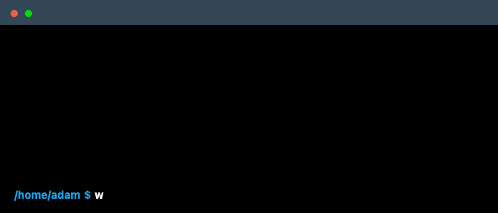

<!--
Hey curious mind! Thanks for checking under the hood.

If you found this helpful or inspiring:
  - Follow me on GitHub @AdamBrauns
  - Connect with me on LinkedIn @adam-brauns

Cheers! -Adam
-->

# Hello!   I'm Adam 👨🏻‍💻

<!--
Terminal gif website: https://www.terminalgif.com
-->

## Connect with Me

[![linkedin-badge]](https://www.linkedin.com/in/adam-brauns)
[![credly-badge]](https://www.credly.com/users/adam-brauns)

## Languages

![python-badge]
![java-badge]
![javascript-badge]
![react-badge]
![nextjs-badge]
![tailwind-badge]
![groovy-badge]
![bash-badge]
![powershell-badge]
![jinja-badge]
![ruby-badge]
![swift-badge]
![php-badge]

## Technologies

![ansible-badge]
![puppet-badge]
![terraform-badge]
![packer-badge]
![git-badge]
![github-actions-badge]
![gitlab-ci-badge]
![jenkins-badge]
![aws-badge]
![azure-badge]
![cloudflare-badge]
![linux-badge]
![windows-badge]
![macos-badge]
![vmware-badge]
![proxmox-badge]
![vagrant-badge]
![virutalbox-badge]
![docker-badge]
![podman-badge]
![kubernetes-badge]
![openshift-badge]
![argocd-badge]
![prometheus-badge]
![grafana-badge]
![nginx-badge]
![apache-badge]
![tomcat-badge]
![traefik-badge]
![kong-badge]
![mariadb-badge]
![microsoft-sql]
![dynamodb-badge]
![postgresql-badge]
![servicenow-badge]
![jira-badge]
![vim-badge]
![vscode-badge]
![insomnia-badge]
![homebrew-badge]
![alacritty-badge]
![starship-badge]
![homeassistant-badge]

## Resume

### Experience

<!--

-->

- 👨🏻‍💻 **Senior Solution Engineer**\
📆 2023 - current\
📍 **Silex Data Solutions** - Franklin, Tennessee

<!--

-->

- 👨🏻‍💻 **DevOps Engineer II**\
📆 2020 - 2023\
📍 **WPS Health Solutions** - Madison, Wisconsin

<!--

-->

- 👨🏻‍💻 **DevOps Engineer**\
📆 2018 - 2020\
📍 **Alliant Energy** - Madison, Wisconsin

<!--

-->

- 👨🏻‍💻 **DevOps Engineer Intern**\
📆 2017 - 2018\
📍 **Alliant Energy** - Madison, Wisconsin

<!--

-->

- 👨🏻‍💻 **Data Science Student Employee**\
📆 2016 - 2017\
📍 **University of Wisconsin - Whitewater** - Whitewater, Wisconsin

### Certifications

- 🏆 **Kong Gateway Certified Associate**\
📜 Kong\
📆 Feb 2026 - Feb 2029\
🔗 Credential ID: 06e81728-315f-4d7b-a207-1caffa56e84a\
🔍 [Verify Credential](https://www.credly.com/badges/06e81728-315f-4d7b-a207-1caffa56e84a/public_url)

- 🏆 **Red Hat Certified OpenShift Administrator**\
📜 Red Hat\
📆 Sep 2025 - Sep 2028\
🔗 Credential ID: 240-085-902\
🔍 [Verify Credential](https://www.credly.com/badges/6552377f-a0a0-480a-832d-87b4764da969/public_url)

- 🏆 **Red Hat Certified Engineer (RHCE)**\
📜 Red Hat\
📆 Jun 2024 - Sep 2028\
🔗 Credential ID: 240-085-902\
🔍 [Verify Credential](https://www.credly.com/badges/3566decd-73fd-482f-b56f-3074aa9fa77e/public_url)

- 🏆 **Red Hat Certified System Administrator (RHCSA)**\
📜 Red Hat\
📆 May 2024 - Sep 2028\
🔗 Credential ID: 240-085-902\
🔍 [Verify Credential](https://www.credly.com/badges/7c8601ac-85e5-4fb5-b992-fa8e4ee3a9ee/public_url)

- 🏆 **Automation Anywhere Certified Advanced RPA Professional**\
📜 Automation Anywhere\
📆 Aug 2022 - Aug 2024\
🔗 Credential ID: AAADVC2022A360 - 57621893\
🔍 [Verify Credential](https://certificates.automationanywhere.com/909dd53d-1257-4773-b445-c913acef8504#gs.9b29gd)

### Education

- 📖 **Computer Science**\
🎓 Graduate Degree\
📆 2017 - 2018\
📍 **University of Wisconsin - Whitewater** - Whitewater, Wisconsin

- 📖 **Computer Science**\
🎓 Undergraduate Degree\
📆 2013 - 2017\
📍 **University of Wisconsin - Whitewater** - Whitewater, Wisconsin

<!--
**AdamBrauns/AdamBrauns** is a ✨ _special_ ✨ repository because its `README.md` (this file) appears on your GitHub profile.

Here are some ideas to get you started:

- 🔭 I’m currently working on ...
- 🌱 I’m currently learning ...
- 👯 I’m looking to collaborate on ...
- 🤔 I’m looking for help with ...
- 💬 Ask me about ...
- 📫 How to reach me: ...
- 😄 Pronouns: ...
- ⚡ Fun fact: ...
-->

<!-- MARKDOWN LINKS & IMAGES -->
<!-- Badge Ref https://github.com/alexandresanlim/Badges4-README.md-Profile#how-to-use -->
<!-- Another Ref https://github.com/Ileriayo/markdown-badges -->

<!-- Language Badges -->
[bash-badge]:       https://img.shields.io/badge/-Bash-000?&logo=gnu-bash
[groovy-badge]:     https://img.shields.io/badge/-Groovy-000?&logo=apache-groovy
[java-badge]:       https://img.shields.io/badge/-Java-000?&logo=openjdk
[javascript-badge]: https://img.shields.io/badge/-JavaScript-000?&logo=javascript
[react-badge]:      https://img.shields.io/badge/-React-000?&logo=React
[nextjs-badge]:     https://img.shields.io/badge/-Next.js-000?&logo=next.js
[tailwind-badge]:   https://img.shields.io/badge/-Tailwind_CSS-000?&logo=tailwind-css
[jinja-badge]:      https://img.shields.io/badge/-Jinja-000?&logo=jinja
[node-js-badge]:    https://img.shields.io/badge/-Node.js-000?&logo=node.js
[php-badge]:        https://img.shields.io/badge/-PHP-000?&logo=php
[python-badge]:     https://img.shields.io/badge/-Python-000?&logo=python
[powershell-badge]: https://img.shields.io/badge/-PowerShell-000?logo=powershell
[ruby-badge]:       https://img.shields.io/badge/-Ruby-000?&logo=ruby&logoColor=red
[swift-badge]:      https://img.shields.io/badge/-Swift-000?&logo=swift

<!-- Connect Badges -->
[credly-badge]:     https://img.shields.io/badge/Credly-FF6B00?style=for-the-badge&logo=credly&logoColor=white
[linkedin-badge]:   https://img.shields.io/badge/LinkedIn-0077B5?style=for-the-badge&logo=linkedin&logoColor=white

<!-- Technology Badges -->
[alacritty-badge]:  https://img.shields.io/badge/-Alacritty-000?&logo=alacritty
[ansible-badge]:    https://img.shields.io/badge/-Ansible-000?&logo=ansible
[apache-badge]:     https://img.shields.io/badge/-Apache-000?&logo=apache&logoColor=red
[argocd-badge]:     https://img.shields.io/badge/-ArgoCD-000?&logo=argo&logoColor=orange
[aws-badge]:        https://img.shields.io/badge/-AWS-000?&logo=Amazon-AWS&logoColor=F90
[azure-badge]:      https://img.shields.io/badge/-Azure-000?&logo=microsoftazure&logoColor=blue
[cloudflare-badge]: https://img.shields.io/badge/-Cloudflare-000?&logo=cloudflare&logoColor=F38020
[dynamodb-badge]:   https://img.shields.io/badge/-Amazon%20DynamoDB-000?&logo=Amazon%20DynamoDB&logoColor=1676BB
[docker-badge]:     https://img.shields.io/badge/-Docker-000?&logo=Docker
[git-badge]:        https://img.shields.io/badge/-Git-000?&logo=git
[github-actions-badge]: https://img.shields.io/badge/-GitHub_Actions-000?&logo=github-actions
[gitlab-ci-badge]:  https://img.shields.io/badge/-GitLab_CI-000?&logo=gitlab
[grafana-badge]:    https://img.shields.io/badge/-Grafana-000?&logo=grafana&logoColor=orange
[homeassistant-badge]: https://img.shields.io/badge/-Home_Assistant-000?&logo=homeassistant
[homebrew-badge]:   https://img.shields.io/badge/-Homebrew-000?&logo=homebrew&logoColor=yellow
[insomnia-badge]:   https://img.shields.io/badge/-Insomnia-000?&logo=insomnia&logoColor=purple
[jenkins-badge]:    https://img.shields.io/badge/-Jenkins-000?&logo=jenkins&logoColor=white
[jira-badge]:       https://img.shields.io/badge/-Jira-000?&logo=jira&logoColor=blue
[kong-badge]:       https://img.shields.io/badge/-Kong-000?&logo=kong
[kubernetes-badge]: https://img.shields.io/badge/-Kubernetes-000?&logo=Kubernetes
[linux-badge]:      https://img.shields.io/badge/-Linux-000?&logo=Linux
[macos-badge]:      https://img.shields.io/badge/-macOS-000?&logo=apple
[mariadb-badge]:    https://img.shields.io/badge/-MariaDB-000?&logo=mariadb&logoColor=2C57A6
[microsoft-sql]:    https://img.shields.io/badge/-Microsoft_SQL_Server-000?&logo=microsoft%20sql%20server&logoColor=CC2927
[nginx-badge]:      https://img.shields.io/badge/-Nginx-000?&logo=nginx&logoColor=lightgreen
[openshift-badge]:  https://img.shields.io/badge/-OpenShift-000?&logo=redhatopenshift&logoColor=red
[packer-badge]:     https://img.shields.io/badge/-Packer-000?&logo=packer
[podman-badge]:     https://img.shields.io/badge/-Podman-000?&logo=podman&logoColor=purple
[postgresql-badge]: https://img.shields.io/badge/-PostgreSQL-000?&logo=postgresql&logoColor=2331619
[prometheus-badge]: https://img.shields.io/badge/-Prometheus-000?&logo=prometheus
[proxmox-badge]:    https://img.shields.io/badge/-Proxmox-000?&logo=proxmox&logoColor=orange
[puppet-badge]:     https://img.shields.io/badge/-Puppet-000?&logo=puppet
[servicenow-badge]: https://img.shields.io/badge/-ServiceNow-000?&logo=funimation&logoColor=green
[starship-badge]:   https://img.shields.io/badge/-Starship-000?&logo=starship
[terraform-badge]:  https://img.shields.io/badge/-Terraform-000?&logo=terraform&logoColor=purple
[tomcat-badge]:     https://img.shields.io/badge/-Tomcat-000?&logo=apache-tomcat&logoColor=yellow
[traefik-badge]:    https://img.shields.io/badge/-Traefik-000?&logo=traefikproxy
[vim-badge]:        https://img.shields.io/badge/-VIM-000?&logo=vim&logoColor=green
[vagrant-badge]:    https://img.shields.io/badge/-Vagrant-000?&logo=Vagrant&logoColor=blue
[virutalbox-badge]: https://img.shields.io/badge/-VirtualBox-000?&logo=VirtualBox&logoColor=darkblue
[vmware-badge]:     https://img.shields.io/badge/-VMware-000?&logo=VMware&logoColor=white
[vscode-badge]:     https://img.shields.io/badge/-Visual_Studio_Code-000?&logo=visual-studio-code&logoColor=blue
[windows-badge]:    https://img.shields.io/badge/-Windows-000?&logo=windows&logoColor=blue
